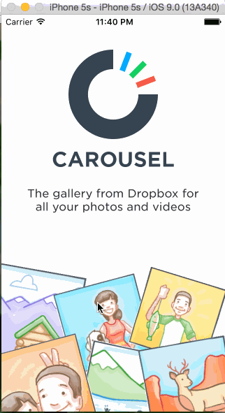

# Carousel Homework for Codepath

The purpose of this app was to learn how to leverage views, view properties, and events to create a high fidelity prototype that is difficult to distinguish from a production app.

Time: I spent around 10 hours on the required tasks and 5 hours on the optional tasks. 

## What can the app do?

* [x]  Static photo tiles on the initial screen
* [x]  Optional: Photo tiles move with scrolling
* [x]  Sign In
* [x]  Tapping on email/password reveals the keyboard and shifts the scrollview and Sign In button up.
* [x]  User sees an error alert when no email is present or no password is present.
* [x]  User sees a loading screen upon tapping the Sign In button.
* [x]  User sees an error alert when entering the wrong email/password combination.
* [x]  User is taken to the tutorial screens upon entering the correct email/password combination.
* [x]  Tutorial Screens
* [x]  User can page between the screens
* [x]  Optional: User can page between the screens with updated dots
* [x]  Optional: Upon reaching the 4th page, hide the dots and show the "Take Carousel for a Spin" button.
* [x]  Image Timeline
* [x]  Display a scrollable view of images.
* [x]  User can tap on the conversations button to see the conversations screen (push).
* [x]  User can tap on the profile image to see the settings view (modal from below).
* [x]  User can dismiss the settings screen.
* [x]  User can log out

*The optional work I completed was:  1) Animated photo tiles tied to scrolling event, 2) User sees pagination (UIPageControl) and it updates as they swipe through demo screens, 3) Upon reaching 4th page - hide PageControl and animate in the call to action button

Walkthrough of all the app stories:

 
The GIF was created with [LiceCap](http://www.cockos.com/licecap/).
